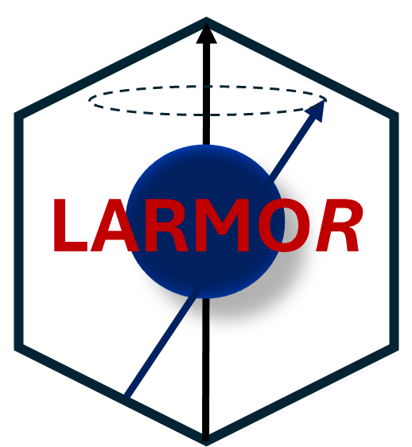
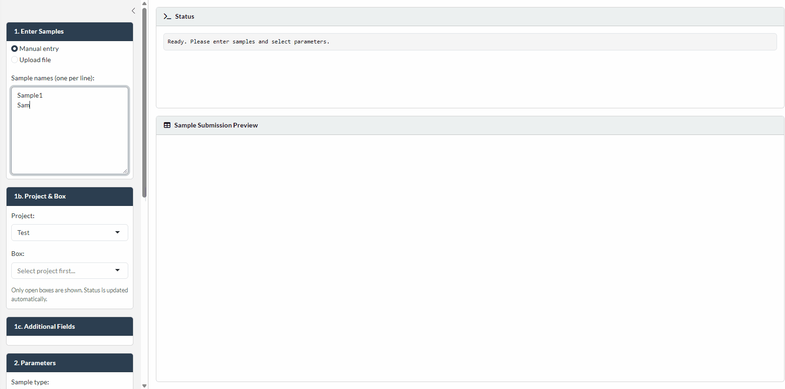
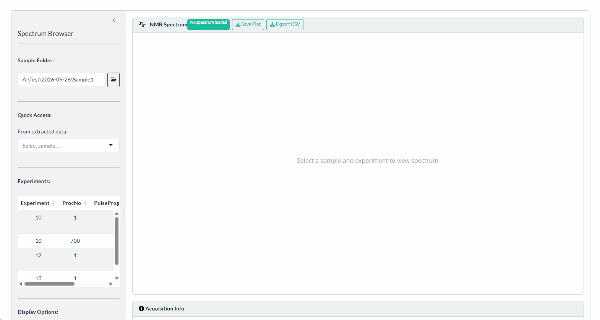

### **Larmor*R***

**L**aboratory **A**utomation Software for NM**R**-based **M**etabolomics **O**peration in **R**

A Shiny application for managing high-throughput metabolomic NMR spectroscopy workflows.

 

 

---

**Larmo*R*** is a shiny application built to streamline the usage of high-throughput NMR spectroscopy. LARMO*R* is designed to create submission ready templates for icon while 
providing archiving and project tracking features for the submitted samples. While this part essentially could work with any experiments submitted through ICON, the remaining features are designed for the 
use with BRUKER's IVDr methods for high-throughput metabolomics.

The app allows the extraction of the Bruker IVDr methods directly through folder search and allows to check B.I.Quant-PS, B.I.Quant-UR and B.I.Biobank-QC measurements. It can highlight missing reports, as well as give
summarized overviews for the QC-Panel. An integrated NMR spectra viewer also allows a quick check of the spectra with region overlay of the metabolites measured.

Additional tools include:

 + QC monitor, which tracks user-speficied parameters and limits for repeated measurements of QC-samples. 
 + NMR Copy, which scans the archive of folder searching for experiments and allows quick selection of samples from large data folders

---

## **Features**
 
+ ### Setup Wizard
  - setup wizard guides user **first time set up**
  - most modules are optional and parameters used in archives completely modifiable
  - settings menu also allow retrospective changes

+ ### Sample Submission Template Creator
  - **create automated .XSLX files for ICON sample submission**
  - creation from files or manual entry
  - select sample type (e.g. plasma, urine)
  - select sequences and SampleJet rack and sample positioning
  - include meta information to be kept in archive (e.g. project, sample size, sample type, sex, age,...)
 
  

+ ### Archiving
  - **persistent archive** created from sample submission module
  - import of archive also possible via setup wizard
  - completely modular approach on which information to retain
  - detailed customisable project archive 
  - measurement archive of all measured metabolites automatically added when extracting data
  - filtering options for in-app creation of sub-archive and project reports

+ ### Biobanking
  - **register sample boxes to projects**
  - project and box can be select in Sample Submission module and will automatically change status
  - tracking the completion status of projects

+ ### Data Extraction
  - **extract Bruker IVDr XML exports** for plasma and urine matrices directly from folder
  - current support for B.I.Quant-PS, B.I.Quant-UR (normal, exteneded and extended neo), B.I.LISA and B.I.Biobank-QC (plasma & urine)
  - directory scanning highlights missing XML files for potential resubmissions
  - export to multi-sheet Excel or individual CSVs (Conc, RawConc, ErrConc, SigCorr, LOD, Lipids, QC report)
  - list of extracted samples is sent to Spectra Viewer for spectral inspection on failed QC reports
  - automated extraction of QC samples into QC Monitor module
  - automated extraction to measurement archive
  - summarized overview of QC-Panels for samples

+ ### Quality Control
  - set up parameters to **track QC samples** (pooled or otherwise prepared)
  - set upper and lower limits for every parameter
  - trend plots, outlier highlighting against upper/lower bounds available
  - **Reagent lot management** — create, archive, reactivate and delete lots
   with date ranges; QC trends filter automatically by the selected lot

+ ### NMR Copy
  - **easy file management** and copy options for large sample set
  - select folder to be copy from BRUKER NMR data
  - upload sample list, select specific date folders or select an entire project from the archive
  - receive list from filtered archive directly
  - automated scan to find measured sequences

+ ### Spectra Viewer
  - **interactive 1D spectra with Plotly** (zoom, pan, region draw)
  - multi-spectrum overlay with optional intensity normalisation
  - **IVDr metabolite region overlay** — ~40 annotated regions with
     310 K chemical shifts, multiplicity and J-coupling, coloured by class
    (BCAA, amino acid, energy, ketone, sugar, SCFA)
  - category filtering and acquisition-parameter inspection

---
 
## **Installation**
See the [Installation Guide](docs/Installation.md) for detailed installation instructions.

---

## **Manual**
See the [User Guide](docs/User-Guide.md) for detailed instructions for the individual modules.
