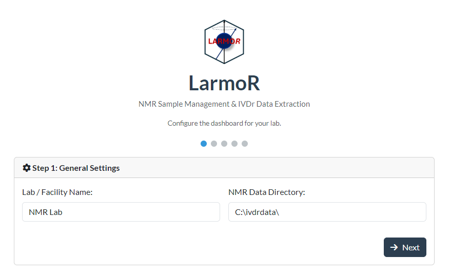
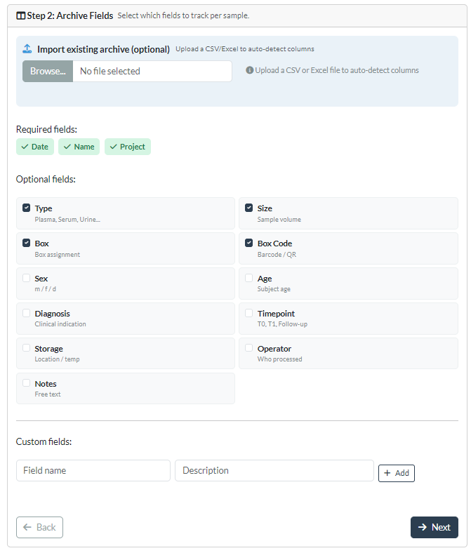
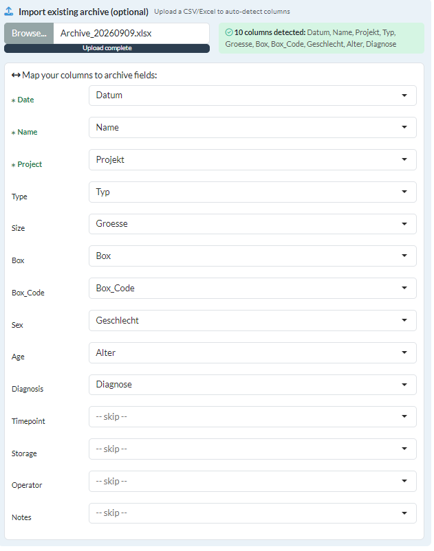
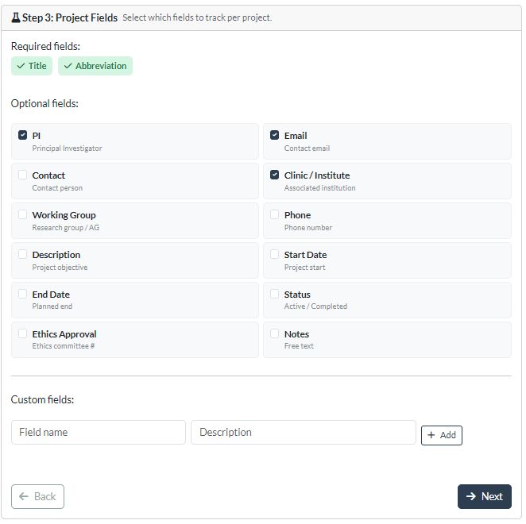
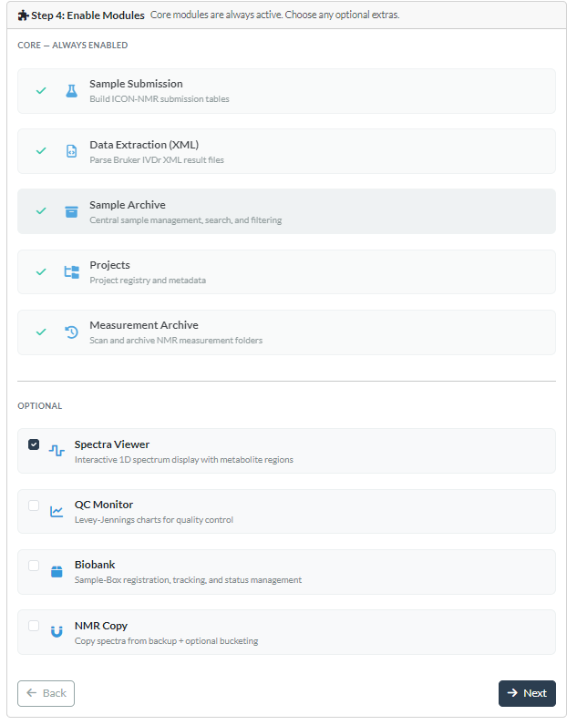
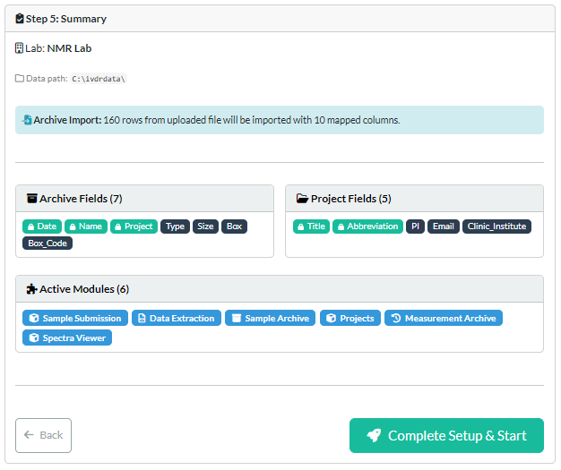

# **Setup Wizard**

The **Setup Wizard** helps set up **LarmoR** for the first time. It guides through the available options and creates all the necessary files. Additionally there are options to upload.
Any settings set up here can also be changed in the **Settings** after initial setup.

## First Time Setup 

### Page 1 - Lab name
The first page covers the name of the laboratory and the default data directory for the NMR data.



The recommended folder structure is:
```
Year\Date\data\Sample\nmr\Experiments
```

### Page 2 - Archive
The second page covers the structure of the Archive and the file `archive.csv`.
Here it is possible to configure the columns that should be tracked. There are some suggestions, but also an open field to enter additional columns.



Alternatively, an already existing archive can be imported. The columns names can than be matched after the upload.



### Page 3 - Projects
The third page follows the same principle as Page 2, but for the Projects Archive and the file `projects.csv`.
Similarly, columns can be added from the suggestions or by adding them manually.



### Page 4 - Modules
The fourth page covers the modules of **LarmoR**. The core modules are always selected, but the optional ones can be hidden, in case they are not wanted.



### Page 5 - Review
The fifth page summarizes all the selections and allows a quick review.



### Final Setup
The app needs to restart after finishing the wizard and the configurations and archives are created accordingly. 

## Reset the Setup Wizward
There is a reset button in the top right corner
of the Start page / Dashboard. This will delete the config files to allow a clean reset. However, the archive files such as archive.csv or projects.csv need to be deleted
manually in the home directory.


