# **User Guide**

**LarmoR** is essentially a accompanying laboratory information management system for high-throughput NMR spectroscopy.
This guide is for new users of the **LarmoR** application to help set up archives and guide through the individual modules.  

**Additional Guides:**

 |  |  |
 |---|---|
 | [README](../README.md) | Main Readme file with brief instructions |
 | [Installation](installation.md) | Information regarding installation |
 | [Troubleshooting](troubleshooting.md) | FAQ and Troubleshooting |
 | [Setup Wizard](Setup_Wizard.md) | First time setup using the **Setup Wizard** |
 | [License](../LICENSE) | |

## Before you start

**LarmoR** is written in a way to keep most modules optional. The core functionality is the **Data Submission**, **Archive** and **Projects** modules. These deliver the core funtions of archiving submitted samples and keeping track of them.
Additionally, the **Biobank** can be used to keep track of sample boxes. **NMR Copy** to scan and copy NMR data files, the **QC-Monitor** to track and investigate QC-sample measurements, and the **NMR Viewer** to show individual NMR spectra.

---

## **Module Overview**

 | Module | Purpose | 
 |---|---|
 | **Start** | Dashboard style structure with overview plots and tables for submitted samples |
 | **Sample Submission** | Submit samples either manually or by file upload to a template ready to be imported into ICON NMR |
 | **Data Extraction** | Extract Brukder IVDr XML data directly into .XSLX or .CSV files |
 | **Archive** | Dashboard style structure for `archive.csv` including plots and tables |
 | **Projects** | Edit and add projects and track registered sample boxes |
 | **Biobank** | Register, edit and delete sample boxes |
 | **QC Monitor** | Track user-set parameters in QC-samples, change lots, obtain overview of trends and outliers |
 | **Measurement Archive** | Extracted Bruker IVDr archive |
 | **NMR Copy** | Scan Bruker NMR folders and copy files based on Projects, dates or sample list |
 | **Spectra Viewer** | View individual NMR spectra, IVDr metabolite overlay available for plasma/serum to investagate spectral quality |
 | **Settings** | Change settings, even after Wizard setup |
 
--- 
 
## **Data structure**

Currently the application relies on the creation of datatables that are essential for its use. Normally, these are created using the "Setup-Wizard", 
but can also be exchanged for pre-existing files or simply modified in the main directory. These consist of the archives used in the modules or even the type of experiments that are listed in the data submission module.
The following files are normally created:

**Archive:**

 | File | Purpose |
|---|---|
| `archive.csv` | Main archive for sample submission |
| `box_registry.csv` | Main archive for the biobank module (e.g. sample boxes) |
| `projects.csv` | Projects list associated with `archive.csv` and `box_registry.csv` |
| `measurement_archive.csv` | Main archive of extracted IVDr data |

**Settings:**
 
 | File | Purpose |
 |---|---|
 | `lipid_naming.csv` | IVDr lipid parameters name updates, new ones can be added |
 | `experiment_types.csv` | List of "other" experiments in Data Submission module for non-IVDr experiments |
 
 The application saves back ups of most of these files in the /backups folder. This is triggered mostly by any changes made to these files within the application.
 
--- 

## **Navigation overview**

All modules can be accessed via the navigation bar. Depending on which modules were selected, the bar might be less populated. Additional modules can still be activeted after using the **Setup Wizard** in the **Settings** tab.
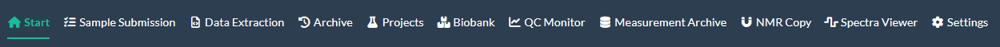

---

# Sample Submission

## Purpose

The **Sample Submission** module allows the creation of .XSLX template ready for submission to ICON-NMR for high-throughput NMR spectroscopy. The module requires the entry of sample names and a project and add these automatically to the 
**Archive** module. It is designed to be used with the Bruker IVDr methods (B.I.Quant, B.I.LISA), the sample type (e.g. plasma, urine) and also the size (5mm vs 3mm)

## ICON Configuration
For the template to be imported successfully the submission template needs to be properly mapped. For IVDr users, this follows the basic setup already used for the calibrations.
However, this is the exact setup for how the columns are mapped inside of ICON.

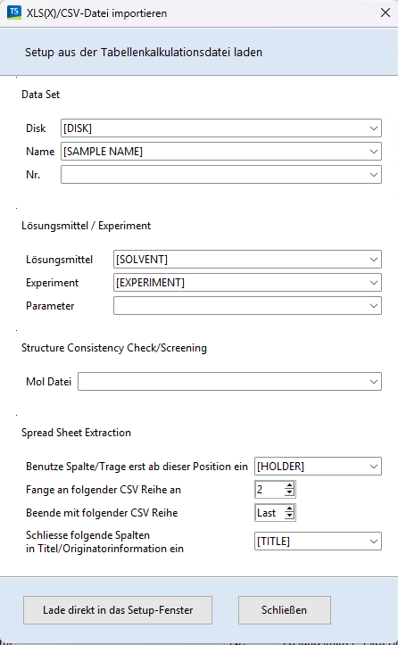

## Prerequisites

Please register relevant boxes and projects before submitted samples, otherwise the dropdowns will not be populated.

## Creating a submission from manual entry

### Step 1 - Enter samples in box
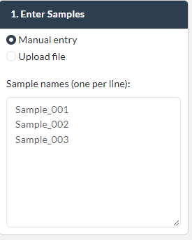

### Step 2 — Select project (and or boxes)
Projects and or boxes must be registered to be shown here. A selected sample box is automatically set to measured and can be tracked in either the **Projects** or the **Biobank** moduel.

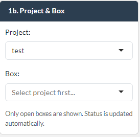

### Step 3 — Choose sample type, tube size and positioning

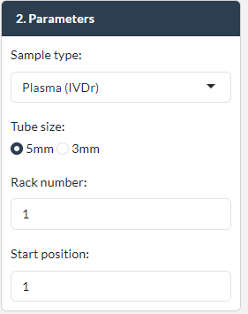

### Step 4 — Select experiments
Depending on the sample type different default experiments are selected.

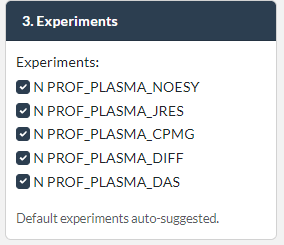

### Step 5 — Enter file path
Default path can be selected during initial setup or in settings. The module creates a folder based on the date and follows the old Bruker convention of using data and nmr folders.

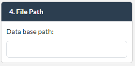

### Step 6 — Generate and export
Press the Generate Sample Submission button and the samples are automatically archived.

The status window gives and overview of the submitted samples

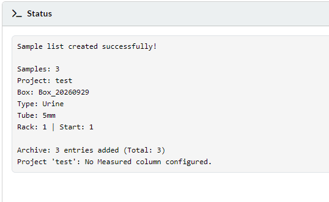

The Sample Submission Preview gives an overview of the created template. The output here shows the column NAME. The actual exported column is called SAMPLE NAME.

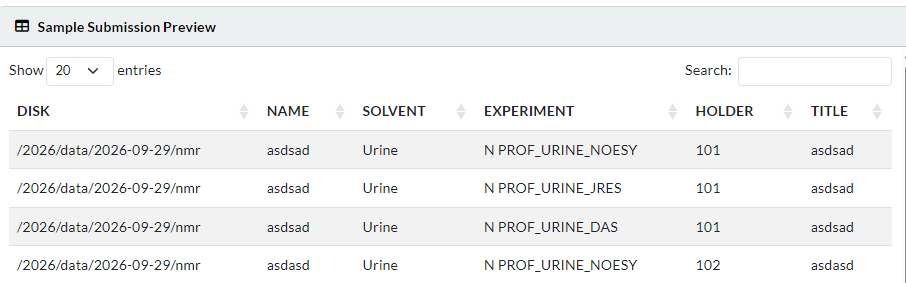

### Step 7 - Download and submit to ICON-NMR
The button only appears after a submission.

## Creating a submission from file import

Alternatively a file with a sample list and additional columns that want to be tracked in the archive such as sex, age or diagnosis can be uploaded directly.

### Accepted file formats
The application accepts .CSV, .TXT or .XSLX file formats

### Required columns
The samples must have the column header 'Name' or it will not be recognized. An example file can be found in the main directory under "Submission_Tester.csv"

### Optional columns
If the archive is tracking additional columns, these can be included in the sample list, however, the column names need to match the archive columns.
The additional archiving columns are higlighted in the interface.

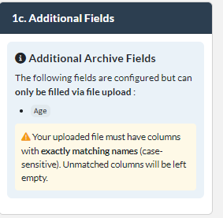

---

# **Data Extraction**

## Purpose
The Data Extraction moduleis designed to extract the data from the Bruker IVDr .XML files. 

## Prerequisites
The data must have been run according to the IVDr SOPs and was analysed be the Data Analysis Server (DAS)

## Supported report types
 
 - B.I.Quant-PS
 - B.I.Quant-UR
 - B.I.LISA
 - B.I.Biobank-QC

## Scanning a directory

### Step 1 — Select sample type

### Step 2- Select Data folder and IVDr Panels
Ideally, the samples were submitted using the **Sample Submission** module and follow the Bruker convention as well as are structured by the date.
Select a date folder and press "Scan for XML Files".

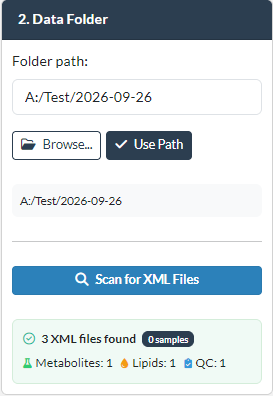

The panels has options depending on the sample type selected above. For B.I.LISA (Lipids) there is an additional option to rename the parameters with a more descriptive name.
For example TPTG would be TG_mg_dl.

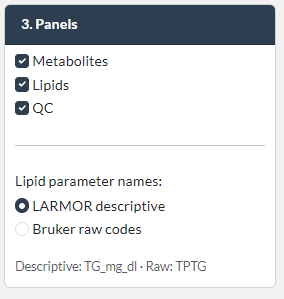

### Step 2 — Review for processing.
The "Extraction Status" gives an overview and compares the selected panels and the present .XML files. It gives a quick guidance over potentially missing reports.

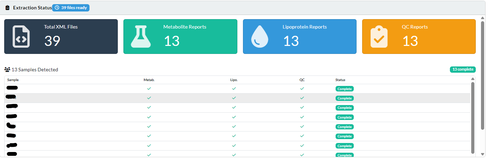

### Step 3 - Start processing

Press the green "Process" button to start processing.
A small pop up tells the status of processing.

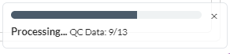

If there are QC samples recognized by the application a pop up will appear and transfer the data of the QC sample directly to the **QC Monitor**.
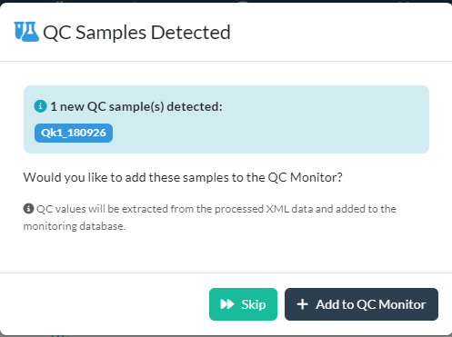

### Step 4 - Investigate QC reports (if available)
A data preview is available for B.I.Biobank_QC that provides a overview of failed and passed QC checks. A similar view will also be exported.

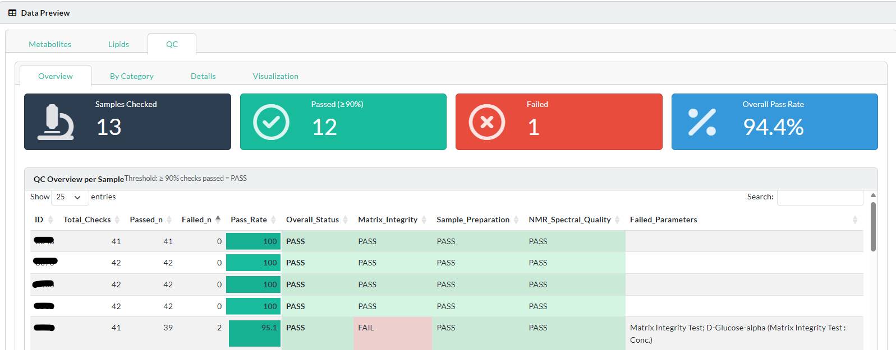

A list of the extracted spectra is also sent to the **Spectra Viewer** module for direct investigation of the NMR spectra.

### Step 4 — Download
After processing the download button. The Data can be downloaded as individual .CSV or as a combined .XSLX

---

# **Sample Archive**

## Purpose

The archive gives a simple overview of the samples submitted via the **Sample Submission** module. During submission the samples are associated with a project.
It provides possibilities to search and filter samples based on the core columns (Project, Type, Size) but also by the sample boxes registered by the **Biobank** module or even the additional columns set up initially such as sex, age or any other metadata.
 

## Viewing and filtering

### Filter controls
Filtering controls are responsive to the columns present in the archive file. 

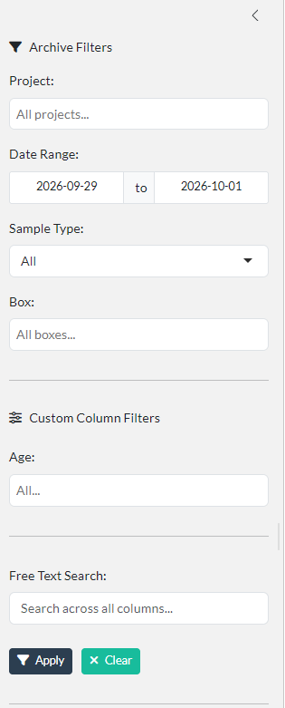

## Editing & deleting entries
The additional columns can also be edited or deleted. Multiple entries can be selected directly in the data table.
Outside of the application the archive.csv can also be edited directly and the app will automatically update the dashboards.

## Adding custom columns
Additional columns can also be added in the **Settings**. 

## Exporting
A filtered archive can be exported to create sub-archive or project reports.

---

# **Projects**

## Purpose

The projects list populates the dropdown in the **Sample Submission** module and projects can be created edited and assoicated with sample boxes using the **Biobank** module.
Similarly, to the archive, the projects list can be populated with additional columns.

## Registering a project
When creating a new project simple click the "New Project" button and fill out the form.

After submission sample boxes can also be registered using the modal. It links directly to the **Biobank** module
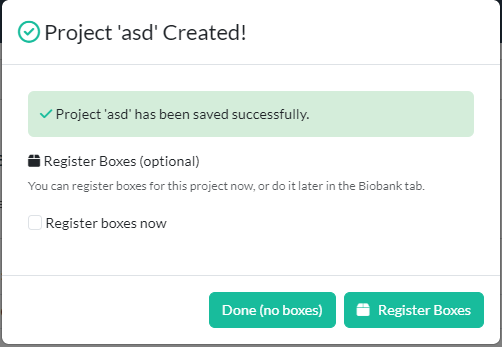

## How projects link to other modules
The projects link to the **Sample Submission** module, as well as the **Biobank** and also the **Measurement Archive**. It is an essential backbone in **LarmoR**.

## Editing and deleting 
Similarly to the **Archive** moduele the projects can easily be edited or deleted.

## Sample box completion
Selecting a project in the project list also opens up the sample boxes registered through the **Biobank** module 
and gives an overview of the completion status. Once a box is selected in the **Sample Submission** its status is changed to measured. 
If only partial boxes are used, this feature should not be used, and edited afterwards.
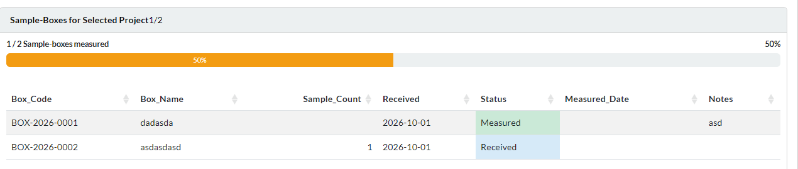

## projects.csv
The data is kept in the file `projects.csv` and can easily be edited outside of the application.

---

# **Measurement Archive**

## Purpose
The measurement archive tracks the extracted data from the **Data Extraction** module. 

## How entries are created
During the extraction the project can selected to be attributed to a measurement.

## Measurement_Archive.xlsx
The overview in the application gives a simple summary of the measured batch of samples, the number of samples, potential QC flags are recoreded.
The data is kept in the file `Measurement.Archive.xlsx` in the home directory. It contains the data split into tabs as well as the overview presented in the application.
The file can easily be edited outside of the application.

# **Biobank**

## Purpose
The biobank tracks sample boxes and associates them with a project. This approach assumes that a whole sample box is measured in a run. Partial measurements are currently no implemented

## Registering boxes
Click on "New Sample Box" to create new boxes 
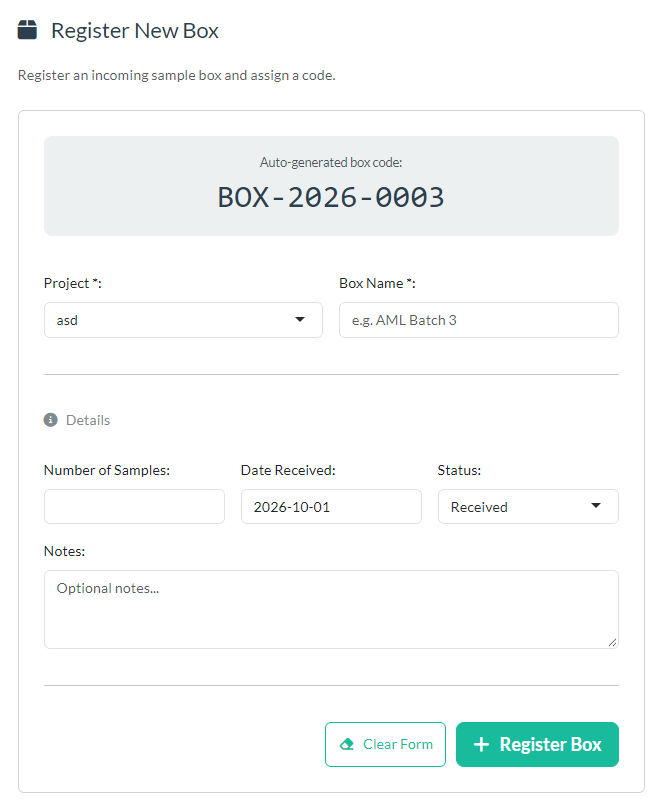

## Box status and completion tracking
When selecting a box in the **Sample Submission** it is automatically marked as measured and its status can be tracked either in the **Biobank** moduel or in the **Projects** tab by selecting the associated project.

## Interaction with Sample Submission
The registered boxes with the status "received" populate the field "Box" in the **Sample Submission** module.

---

# **QC Monitor**

## Purpose
The QC monitor can track the values of metabolic parameters for QC purposed. An integrated batch system allows the creation of new lots. 

## Concepts
During extraction using the **Data Extraction** module samples are searched for that contain the name "QC" and are automatically added to the module. Under settings the parameters and their limits can be set and the other tabs will automatically
be populated with the values.

## Initial setup

### Step 1 — Define the QC sample pattern
The string pattern to search for QC samples in the extracted data can be set in the QC settings.
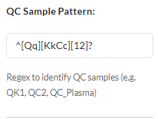

### Step 2 — Add parameters to track and set limits
Go to settings and add parameters and limits or import an older file.
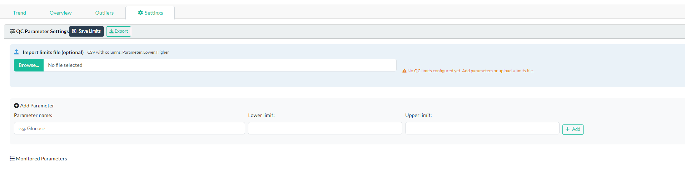

## Reagent lot management

New lots can be created using the QC Settings sidebar and the appearing modals

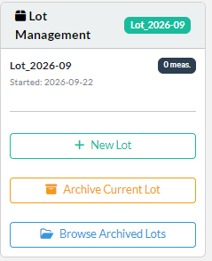

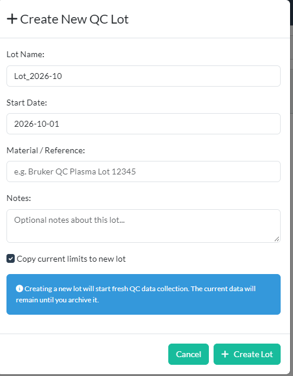

Lots can also be archived and deleted using the same submenu.

## Investigating the QC data
The trend plots show one metabolite and the upper and lower limits are drawn as horizontal lines. The plot shows the measurement of the QC over time and highlights and deviations from the set limits.
The oveview tab shows the measurements and the which parameter or samples are within limits or not. Similarly the outliers tab shows just the outliers that are out of bounds.

---

# **NMR Copy**

## Purpose
The **NMR Copy** module allows for the search of NMR expeirments and provides an easy way to gather the spectral data of projects and sample batches.

## Selecting a source folder
The module scans the selected folder. Ideally the folders are structured by date (e.g. 2026/01-10-2026/Samples/...). This provides an easy way to locate folder and measurements that were submitted using the other modules.

## Choosing what to copy
### From an uploaded sample list
A sample list can be uploaded that and the module scans the folders for the file names of the samples

### By date folder
The module will scan the selected folder and present the folder structure based on date (if that format is used)

### By project from the archive
Here a project from the archive/project list can be selected and the associated samples will be highlighted.

## Sequence scanning
the module automatically detects the NMR pulse sequences used provides a selection of which specific sequences should be copied.

## Running the copy
Simply select the source and destination folders and copy the desired experiments using the module. Of course, depending on the amount of files, this process can take a longer time.

## NMR Bucketing
Additionally the data can be bucketed using the excellent PepsNMR batch bucketing feature. In this case a .CSV is provided with the output.

---

# **Spectra Viewer**

## Purpose
The **Spectra Viewer** Module allows loading and inspecting of individual spectra for QC purposes

## Loading spectra
A sample folder can be selected and the module automatically detectes the measured experiments and presents them in a table. These can be then selected and the spectra can be inspected.

### From the Data Extraction handoff
Alternatively, when samples were extracted using the **Data Extraction** module, a list will appear under "Quick Access".

## IVDr metabolite region overlay
In addition to help with investigating the goodness-of-fit of the Bruker IVDr methods. The regions of the fitted metabolites can be highlighted. The names and colors are overlaid on the spectrum and give a visual guide to
the fitting of the metabolites.

## Limitations
The current setup is set up for Bruker IVDr standards and follows the SOPs. Using a 600 MHz field strength and a temperature of 310K and a neutral pH value.

---

# **Settings**
The **Settings** module allows to change the settings that were initially set by the **Setup Wizard**.

## Archive columns
Here additional columns for the `archive.csv``  can be added or deleted. New columns can be selected to be either text, numeric or restricted to a selection.
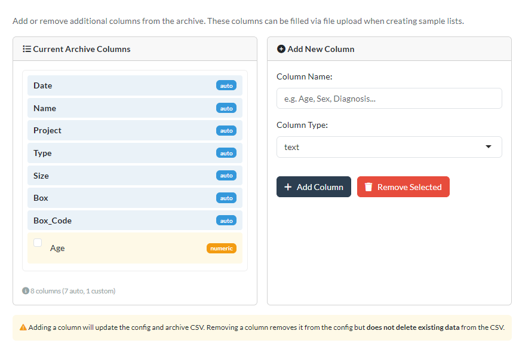

## Project columns
Here additional columns for the `projects.csv` can be added or deleted. New columns can be selected to be either text, numeric or restricted to a selection.
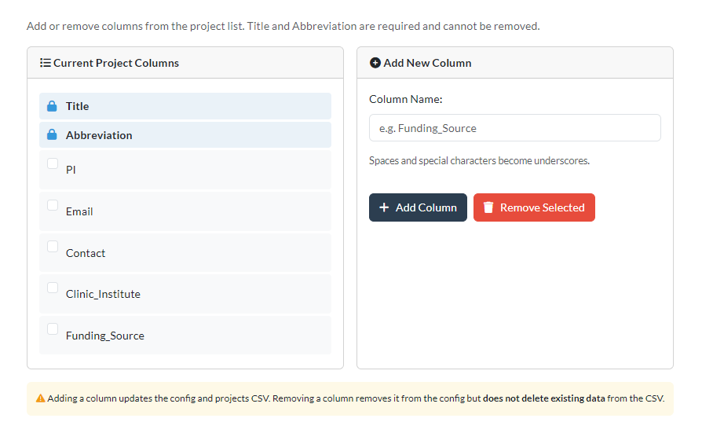

## Modules
Here modules can be activated or deactivated.

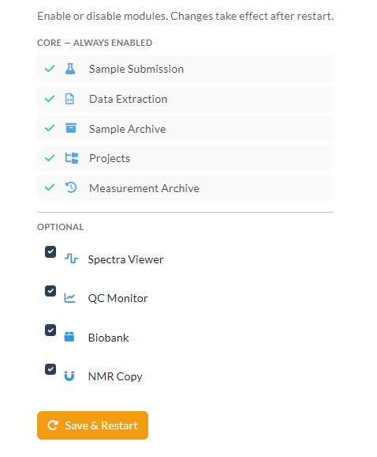

## General
The name of the current laboratory as it appears in the top left corner can be changed here and also the default data path.

## When a restart is needed
After changes a restart is often needed. The application should either suggest it itself or provide a button for it.